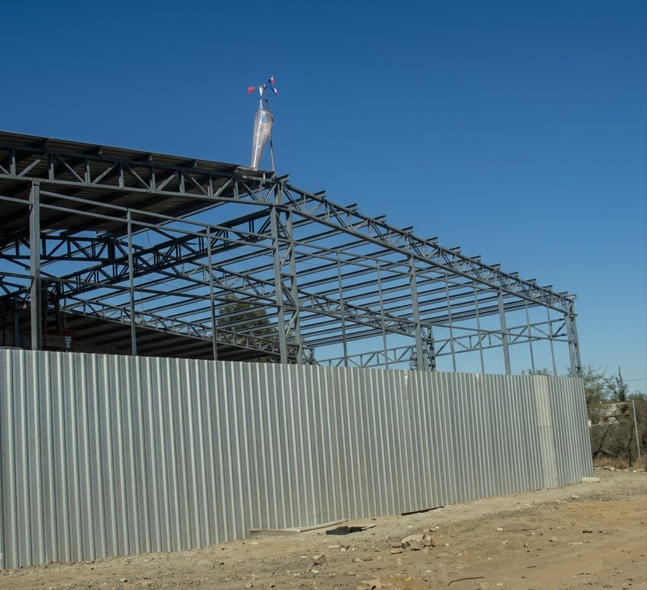

# 🏗️ DA_Construcciones

[](https://astro.build/)
[](https://tailwindcss.com/)
[](https://opensource.org/licenses/MIT)

Sitio web profesional para **DA_Construcciones**, empresa especializada en fabricaciones metálicas, estructuras menores y mejoras para el hogar. Un diseño moderno, minimalista y enfocado en resaltar la calidad del trabajo artesanal.

---

## 📸 Galería de Proyectos

<div align="center">
  
  
</div>

> *Calidad, precisión y compromiso en cada estructura.*

---

## ✨ Características Principales

- ⚡ **Alto Rendimiento:** Construido con Astro 4 para una velocidad de carga excepcional.
- 📱 **Diseño Responsivo:** Optimizado para móviles, tablets y computadoras.
- 🎨 **Estética Premium:** Paleta de colores industrial (Dorado, Azul Acero, Carbón).
- 🎞️ **Animaciones Fluidas:** Sistema de *scroll reveal* nativo para una experiencia interactiva.
- 🛠️ **Portfolio Dinámico:** Galería filtrable por categorías y años.

---

## 🚀 Inicio Rápido

Sigue estos pasos para ejecutar el proyecto localmente:

1. **Clonar el repositorio:**
   ```bash
   git clone https://github.com/Svkkit/DA_construcciones.git
   cd DA_construcciones
   ```

2. **Instalar dependencias:**
   ```bash
   npm install
   ```

3. **Iniciar servidor de desarrollo:**
   ```bash
   npm run dev
   ```
   Abre [http://localhost:4321](http://localhost:4321) en tu navegador.

---

## 📂 Estructura del Proyecto

```text
src/
├── components/       # Componentes modulares (Hero, Navbar, Portfolio, etc.)
├── images/           # Activos visuales y fotografías de proyectos
├── layouts/          # Plantilla base y configuración de estilos globales
└── pages/            # Rutas del sitio (index.astro)
```

---

## 🛠️ Tecnologías

- **Framework:** [Astro](https://astro.build/)
- **Estilos:** [Tailwind CSS](https://tailwindcss.com/)
- **Fuentes:** Inter & Playfair Display (via Google Fonts)
- **Iconos:** Lucide (disponible para expansión)

---

## 📧 Contacto

Si tienes alguna duda sobre el proyecto o quieres saber más sobre **DA_Construcciones**:

- **Ubicación:** Chile
- **Especialidad:** Estructuras metálicas, portones, rejas y galpones.
- **Desde:** 2016

---

<p align="center">
  Desarrollado con ❤️ para DA_Construcciones
</p>
